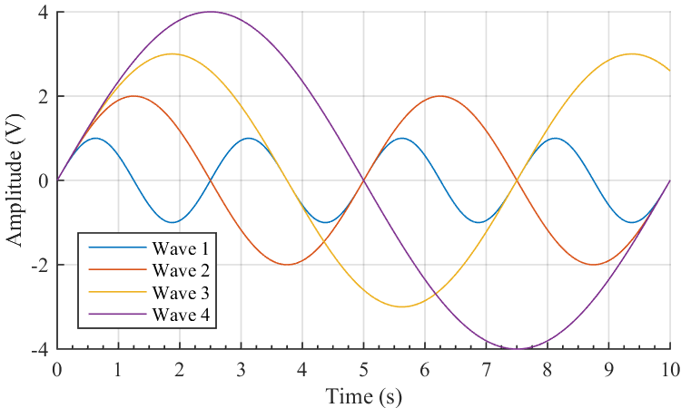
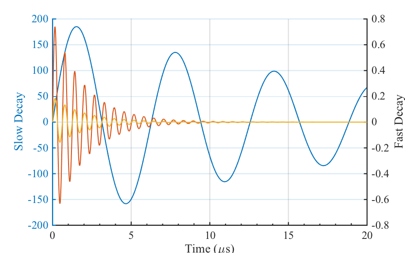

# matlab-printfg #
A collection of [MATLAB®](http://www.mathworks.com/products/matlab/) functions that aim to simplify generating and exporting print-quality figures.


## Usage
In order to print a figure to a file, capture the figure's handle and pass it to the function `printfg()`, together with filename and output format. For instance, to save a 2-D plot to a PNG file named `figure.png` use:

```matlab
hf = figure;
plot(1:10, 1:10);
printfg(hf, 'figure', 'png');
```

Notice that there is no need to specify file extension as part of the filename, since `printfg()` is smart enough to figure it out on its own. You can also save a figure to multiple files with different extensions at the same time:

```matlab
printfg(hf, 'figure', {'png', 'eps'});
```

Any extension supported by MATLAB's native `saveas()` and `print()` functions is also supported by `printfg()`, with the following caveat: `eps` is shorthand for PostScript Color, as opposed to the usual monochrome output.

### Size
By default, `printfg()` will attempt to use the figure's actual size on screen for printing. Print size can also be specified as a two-element vector defining width and height in __points__:

```matlab
printfg(hf, 'figure', 'png', [500, 250]);
```

Different units are supported through the use of [properties](#properties):

```matlab
prop.Figure.PaperUnits = 'inches';
printfg(hf, 'figure', 'png', [5, 3], prop);
```

### Properties
Figure properties can be specified as nested struct arrays under eight possible parent fields or categories, and will be applied to any corresponding objects found.
- `prop.Figure`, properties to be applied directly to the _figure_ handle.
- `prop.Axes`, properties to be applied to any nested _axes_ objects (legends and colorbars excluded).
- `prop.Legend`, properties to be applied to _legends_.
- `prop.Line`, properties to be applied to _line_ objects, such as plots.
- `prop.Title`, properties to be applied to the figure's _title_.
- `prop.XLabel`, `prop.YLabel` and `prop.ZLabel`; properties to be applied to axes _labels_.

So, for instance, a set of properties can be defined to create an output style, which will be applied automatically by `printfg()` before printing. This can come in particularly handy when batch exporting a number of different figures using similar styles:

```matlab
%% Define figure properties
prop.Axes.XMinorTick = 'on';
prop.Axes.FontName = 'Times New Roman';
prop.Line.LineWidth = 2;
prop.Title.FontSize = 12;

%% Generate a bunch of plots
% ...

%% Print figures as PostScript
printfg(hf1, 'figure1', 'eps', [400, 220], prop);
printfg(hf2, 'figure2', 'eps', [400, 220], prop);
```

## Samples
Check out some examples of the output produced by `printfg()` inside the [ samples](samples/) sub-folder.




## Known Issues
- Newer MATLAB versions (&geq;R2014b) seem to produce different results with print sizes and margins than earlier versions.
- On figures with multiple axes, large labels might get cut off, depending on which output format is used (i.e. changing from `png` to `pdf` might help).

## License
matlab-printfg is open-sourced software licensed under the [MIT License](http://opensource.org/licenses/MIT). For the full copyright and license information, please view the LICENSE file that was distributed with this source code.
